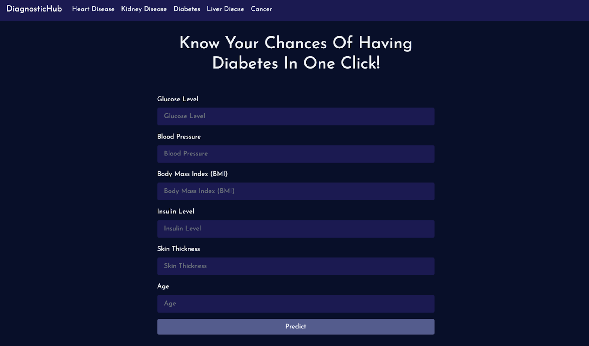

## DiagnosticHub

DiagnosticHub is an advanced disease prediction system designed to predict the likelihood of conditions such as heart disease, diabetes, liver disease, kidney disease, and breast cancer. This project aims to enhance diagnostic accuracy, offering a reliable tool for early detection of critical health conditions.

### Features

- **Multi-Disease Prediction**: Predicts the likelihood of developing heart disease, diabetes, liver disease, kidney disease, and breast cancer using advanced machine learning models.
- **Real-time Health Risk Assessment:** Provides immediate feedback on disease risk, offering users valuable insights for early intervention and health management.
- **Prediction Across Multiple Organs:** Predicts the likelihood of diseases affecting various organs, including the heart, liver, kidney, and pancreas, enabling comprehensive health assessments.

### Tech Stack

- **HTML & CSS:** For the frontend design and structure.
- **Bootstrap:** Frontend framework for responsive UI.
- **Python:** Backend development and disease prediction model.
  
#### Libraries

- **scikit-learn:** Used for the Random Forest model and machine learning tasks.
- **Pandas:** Data handling and manipulation.
- **NumPy:** Numerical operations and array handling.
- **Joblib:** Used to save and load the trained models.

### Dataset Used

1. [Breast Cancer](https://www.kaggle.com/uciml/breast-cancer-wisconsin-data)
2. [Diabetes](https://www.kaggle.com/uciml/pima-indians-diabetes-database)
3. [Liver](https://www.kaggle.com/uciml/indian-liver-patient-records)
4. [Heart Disease](https://www.kaggle.com/ronitf/heart-disease-uci)
5. [Kidney Disease](https://www.kaggle.com/mansoordaku/ckdisease)

  
### Getting Started

1. **Clone the Repository:**
   ```bash
   git clone https://github.com/YourUsername/DiagnosticHub.git
   ```

2. **Navigate to the Project Directory:**
   ```bash
   cd DiagnosticHub
   ```

3. **Install Dependencies:**
   ```bash
   pip install -r requirements.txt
   ```
   
4. **Run the Flask Application:**
   ```bash
   python app.py
   ```
4. **Access the Application:**
   - Open your browser and go to http://localhost:5000 to start using the DiagnosticHub.

### App Preview




### Contributing

We welcome contributions to make DiagnosticHub even more feature-rich and accurate. Please fork the repository, make your changes, and submit a pull request.

### License

This project is licensed under the [MIT License](LICENSE).

### Acknowledgements

- Special thanks to the open-source community for the tools and libraries used in this project.
- Grateful for the Kaggle datasets that provided essential data for training the models.
Feel free to explore, contribute, and create a vibrant chatting experience with ChatNexa!
